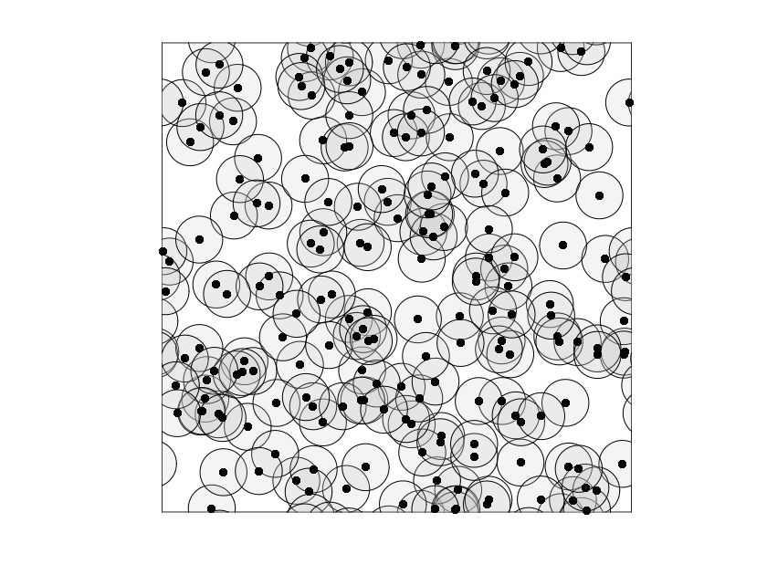
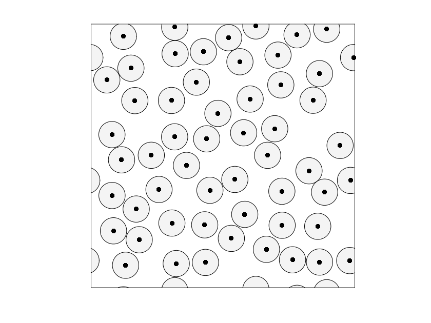
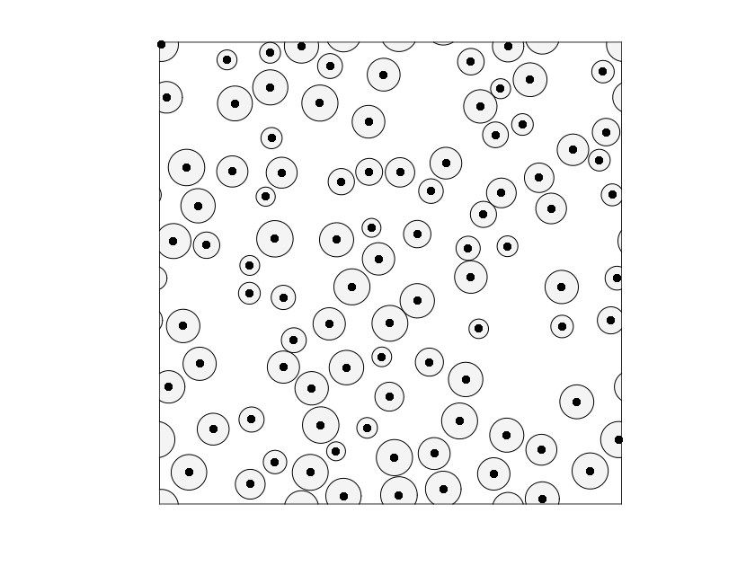
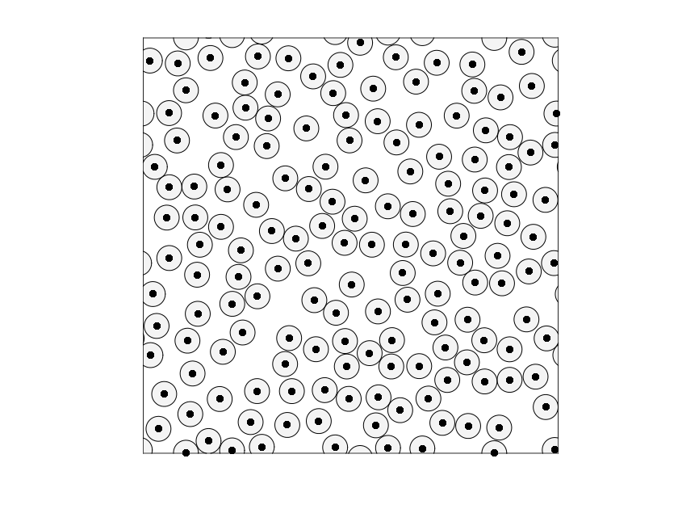
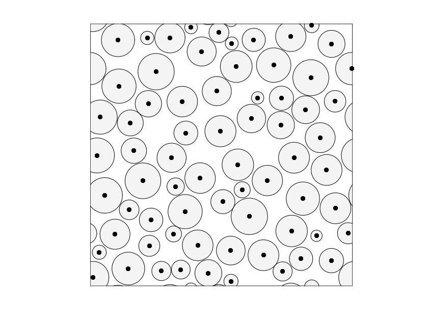
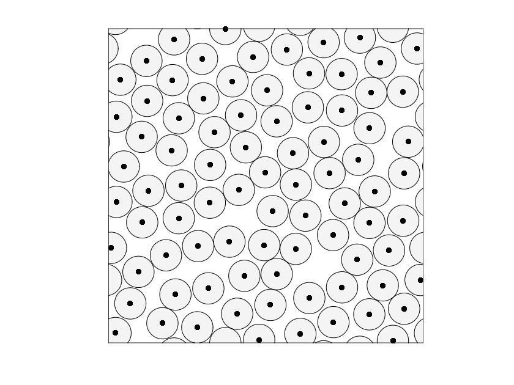
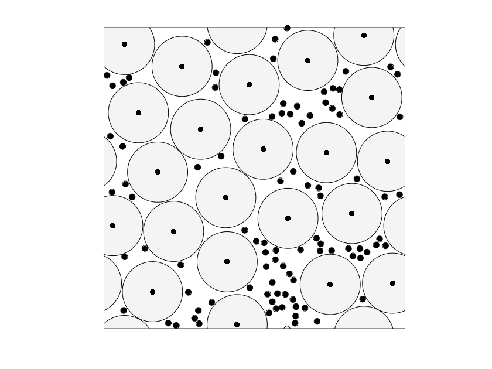
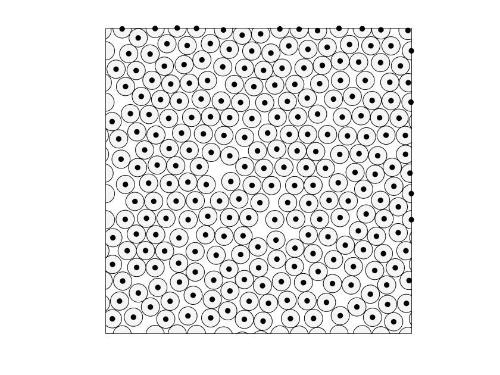
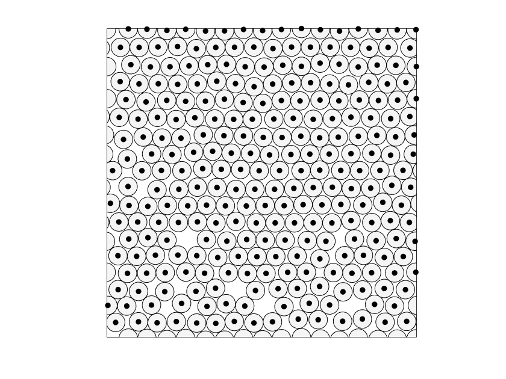

# ACEMS2017
My [ACEMS2017 competition](https://acems.org.au/2017-student-competition) scripts and solutions. See their page for a full description of the problem. The aim is to maximize the non-intersecting packing of a bunch of discs on the unit torus, given in a csv file. For example, the [200.1.csv](200.1.csv) file contains these discs:

You are also required to submit a MATLAB program to solve 3 hidden cases. 15 minutes is allowed per hidden case. For this reason I used MATLAB for all parts. 

The key scripts are:
 * [runILP.m](runILP.m) - attempts to phrase the problem as an integer linear program and solve it that way. Uses gurobi because matlab's solver is too slow. It works well up to 1000 discs and not so well after that.
 * [runIterated_ILP.m](runIterated_ILP.m) - Similar to runILP.m, except The region is then divided into number_of_iterations sections, and the constraints are adjusted so that one section is 'packed' at a time, whilst holding the other sections in their previous state, where the initial state is empty. Uses gurobi because matlab's solver is too slow. 
 * [submission_script.m](submission_script.m) - The submission script in the format required. It uses an ILP approach for the smallest case. It packs the large discs with ILP and then the small ones in the medium-sized case. A greedy method is used in the large case. Matlab's ILP solver is used since it has to run on the organisers machine. There is definately scope for improvement of the greedy algorithm particularly. 
 * [plotdiscs.m](plotdiscs.m) - Plots a solution. Provided by the organisers
 * [generate_intersections_range_runpar.m](generate_intersections_range_runpar.m) - Precaches the constraint matrix of pairwise intersections and saves it in a file. I haven't included the 50000.1 intersection file in the repository, so you'd need to run this first for that case. It's an inefficient algorithm, O(N^2), but it was faster to run it once than implement something in O(N log N
).  
## Final Solutions
Here are my solutions .

#### 200.1
Solved with an integer linear program method - [runILP.m](runILP.m). The solution is optimal.

#### 200.2
Solved with an integer linear program method - [runILP.m](runILP.m). The solution is optimal.

#### 500.1
Solved with an integer linear program method - [runILP.m](runILP.m). The solution is optimal.

#### 500.2
Solved with an integer linear program method - [runILP.m](runILP.m). The solution is optimal.

#### 1000.1
Solved with an integer linear program method - [runILP.m](runILP.m). The solution is optimal.

#### 1000.2
Solved with an integer linear program method - [runILP.m](runILP.m). The solution is optimal.

#### 10000.1
Solved with an iterated integer linear program method - [runIterated_ILP.m](runIterated_ILP.m) with 3 iterations. 
I think this is the most likely case for further tweaking of my approach to get a better solution. There are quite a few voids. 

#### 50000.1
Solved with an iterated integer linear program method - [runIterated_ILP.m](runIterated_ILP.m) with 5 iterations. I doubt it's optimal, but it's pretty clearly within a couple of discs of the optimum. I'm not sure the approach used could do any better.

